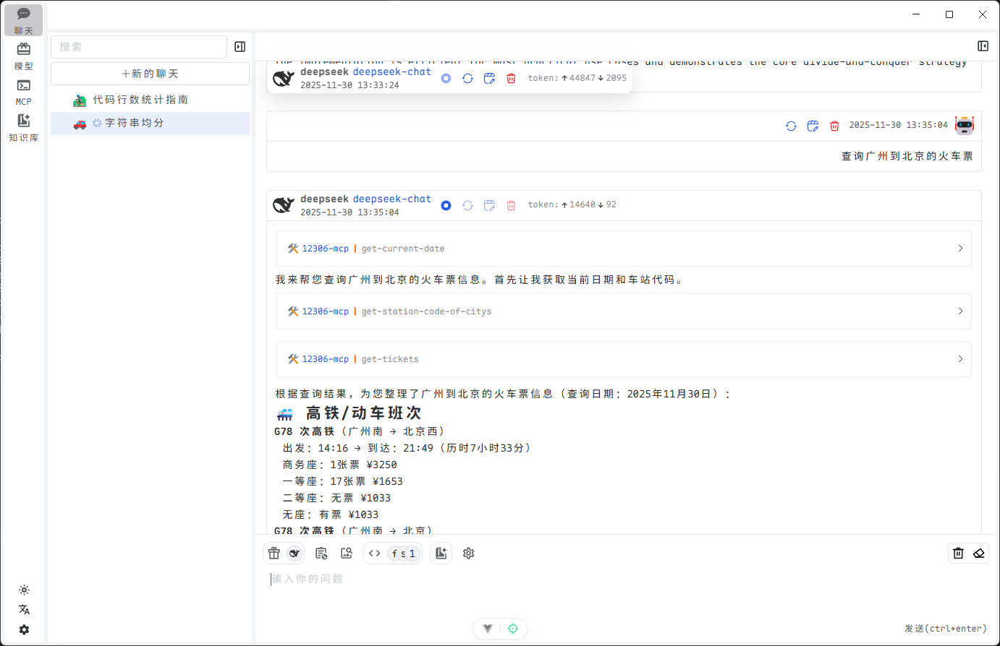
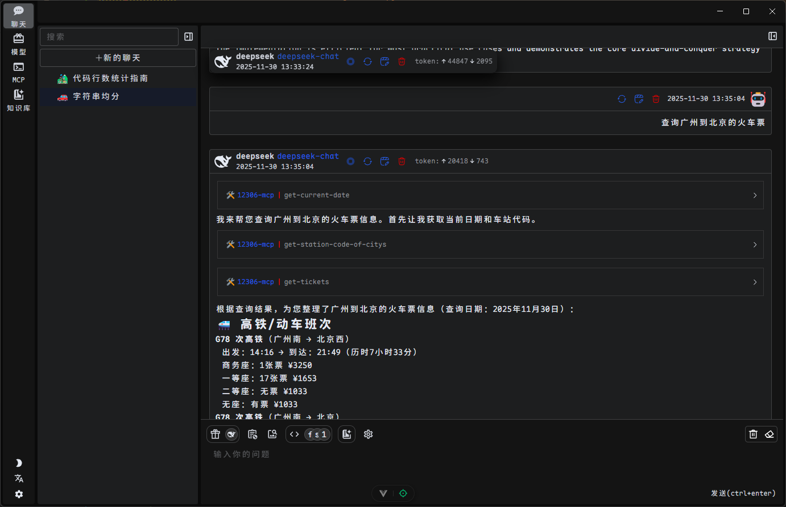

<p align='center'>

</p>

  

<div align="center">
  <a href="./README.zh.md">中文</a> / <a href="./README.md">English</a>
</div>

# windflow

🍃 windflow - 使用多个AI供应商增强您的自动化工作流

## 🌟 功能特性

### AI驱动的开发

- **多模型支持**: 连接到各种LLM提供商，包括OpenAI、DeepSeek、SiliconFlow等
- **本地知识库(RAG)**: 通过文档解析和向量嵌入构建和搜索本地知识库
- **模型上下文协议(MCP)**: 通过标准化工具协议扩展AI功能，提升工作效率

### 桌面应用程序功能

- **跨平台**: 在Windows、macOS和Linux上运行
- **持久化存储**: 本地存储对话、设置和知识库
- **可定制主题**: 浅色/深色/系统主题，自动适应标题栏

### 开发者体验

- **集成环境**: 统一的聊天、编码和知识管理界面
- **上下文感知**: 维护对话历史和文档上下文
- **可扩展架构**: 插件系统用于添加自定义工具和集成
- **性能监控**: 跟踪令牌使用情况和性能指标

## 👀 预览





## 🧽 下载

<div align=left>
<table>
    <thead align=left>
        <tr>
            <th>操作系统</th>
            <th>下载</th>
        </tr>
    </thead>
    <tbody align=left>
        <tr>
        <tr>
            <td>Windows</td>
            <td>
                <a href="https://github.com/evilArsh/windflow/releases"></a><br>
                <a href="https://github.com/evilArsh/windflow/releases"></a>
            </td>
        </tr>
        <tr>
            <td>macOS</td>
            <td>
                <a href="https://github.com/evilArsh/windflow/releases"></a><br>
                <!-- <a href="https://github.com/evilArsh/windflow/releases/download/v$$VERSION$$/windflow-$$VERSION$$-macos-amd64.dmg"></a><br> -->
            </td>
        </tr>
        <tr>
            <td>Linux</td>
            <td>
                <a href="https://github.com/evilArsh/windflow/releases"> </a><br>
                <a href="https://github.com/evilArsh/windflow/releases"> </a><br>
            </td>
        </tr>
    </tbody>
</table>

## ⚙️ 安装

### 先决条件

- Node.js >= 22.10.0
- pnpm >= 10.12.4
- Git

### 设置开发环境

```bash
# 克隆仓库
git clone https://github.com/evilArsh/windflow.git
cd windflow

# 安装依赖
pnpm i -r

# 启动开发服务器
pnpm dev
```

### 📦 生产构建

```bash
# 为特定平台打包
pnpm build:win    # Windows
pnpm build:mac    # macOS
pnpm build:linux  # Linux
```

## 🏗️ 架构

windflow 遵循典型的 Electron 多进程架构：

### 主要包

项目组织为几个主要包：

#### @windflow/core

应用程序的核心业务逻辑和服务：

- **消息处理**: 用于聊天交互的上下文管理、钩子函数、存储和实用工具
- **模型**: 核心模型管理和实用工具
- **提供商**: 与多个 LLM 提供商的集成（OpenAI、DeepSeek、SiliconFlow、VolcEngine 等）
- **存储**: 用于聊天、嵌入、知识库、MCP 工具、模型、预设、提供商、RAG 文件和设置的全面存储解决方案
- **类型**: AI、聊天、知识、提供商、请求和存储系统的类型定义

#### @windflow/markdown

Markdown 处理和渲染实用工具：

- **Vue 集成**: 专用于基于 Vue 的 Markdown 渲染的专门缓存、类型和实用工具
- **处理管道**: 由 unified、remark 和 rehype 生态系统提供支持
- **功能**: 支持数学公式、GFM（GitHub 风格 Markdown）、表情符号、HTML 转换等
- **基于 Worker**: 包含专门的 worker 以实现高效的 Markdown 处理

#### @windflow/shared

应用程序间共享的类型和实用工具：

- **类型定义**: 环境变量、事件总线、文件类型、MCP（模型上下文协议）、RAG 和主题设置
- **实用工具**: 环境助手、服务定义、MCP 协议实现
- **跨包实用工具**: 其他包使用的公共函数和常量

### 渲染进程

- **Vue 3 前端**: 使用组合式 API 构建的现代响应式 UI
- **Pinia 状态管理**: 应用数据的集中状态管理
- **Element Plus UI**: 功能丰富的组件库
- **Monaco 编辑器**: 具有语法高亮的高级代码编辑器

### 关键组件

#### RAG (检索增强生成) 服务

RAG 服务启用本地知识库的创建和查询：

- 多种格式的文档解析（Word、PDF、CSV、Excel）
- 文本分块和向量嵌入
- 使用 LanceDB 的本地向量数据库
- 用于上下文感知响应的相似性搜索

#### MCP (模型上下文协议) 服务

通过标准化协议扩展 AI 功能：

- 与外部工具和服务集成
- AI 工具的标准化通信协议
- 支持 stdio、HTTP 和 SSE 传输

#### 主题服务

提供可定制的 UI 外观：

- 浅色、深色和系统主题
- 自动标题栏覆盖适配
- 原生主题变更检测

## 🤝 贡献

欢迎为WindFlow做出贡献！您可以这样帮助我们：

1. Fork仓库
2. 创建功能分支 (`git checkout -b feature/amazing-feature`)
3. 提交更改 (`git commit -m 'Add some amazing feature'`)
4. 推送到分支 (`git push origin feature/amazing-feature`)
5. 发起Pull Request

请确保您的代码遵循我们的编码标准并通过所有测试。

## 📄 许可证

本项目采用Apache-2.0许可证 - 详情请见[LICENSE](LICENSE)文件。

## 🙏 致谢

- [lobe-icons](https://github.com/lobehub/lobe-icons.git) - LLM提供商图标
- [iconify](https://iconify.design/) - SVG图标集
- [Electron](https://www.electronjs.org/) - 跨平台桌面应用框架
- [Vue.js](https://vuejs.org/) - 渐进式JavaScript框架
- [LanceDB](https://lancedb.com/) - 现代AI应用向量数据库

## 💬 支持

如需支持，请在GitHub上提交issue或联系维护人员。